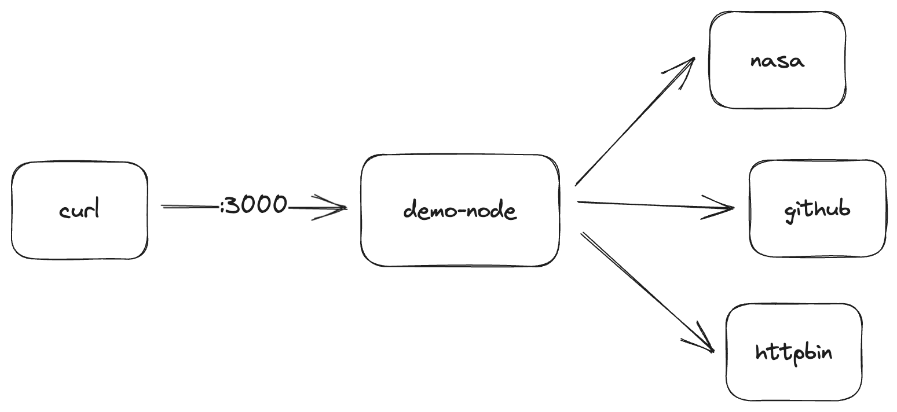

# Great App: demo-node

This app has a couple of different endpoints:
* `/` returns a generic response
* `/nasa` will get the NASA picture of the day (as JSON)
* `/events` reads some GitHub events
* `/bin` calls `httpbin`



After you get the application running on your machine, you're going to capture traffic with Speedscale like so:


And once you're able to process the traffic properly, you are going to replay the tests and mocks like so which lets you run numerous different scenarios and isolate yourself from the backend dependencies.


# Local Workflow

Pre-requisites:
* `node` 18.x and `npm` installed

## Install and Run the App

Install the dependencies:

```
npm install
```

Then you can run it:
```
npm start
```

If the log looks like this it's working:

```
> demo-node@1.0.0 start
> node index.js

demo-node listening on port 3000
```

## Send Test Transactions

This will send calls port 3000 which is the default. These commands are expected to succeed, if they fail your environment may be misconfigured.

```
export PORT=3000
curl http://localhost:$PORT/healthz
curl http://localhost:$PORT/nasa
curl http://localhost:$PORT/events
curl http://localhost:$PORT/bin
```

## Capture 

You need a Speedscale account and `speedctl` installed. If you just want to do something quiclky on your local machine, you can capture the inbound and outbound traffic using `speedctl` with this command:

```
speedctl capture demo-node 3000
```

Now you need to configure your application to use the proxy, this is from the [Speedscale Docs](https://docs.speedscale.com/setup/sidecar/proxy-modes/#configuring-your-application-proxy-server).

```
export GLOBAL_AGENT_HTTP_PROXY='http://127.0.0.1:4140'
export GLOBAL_AGENT_HTTPS_PROXY='http://127.0.0.1:4140'
export GLOBAL_AGENT_NO_PROXY='*127.0.0.1:12557'
export NODE_EXTRA_CA_CERTS=${HOME}/.speedscale/certs/tls.crt
```

Once that's done you are going to restart the application:

```
npm start
```

Now you're going to send the same test transactions, but the inbound port has changed to `4143`:

```
export PORT=4143
curl http://localhost:$PORT/healthz
curl http://localhost:$PORT/nasa
curl http://localhost:$PORT/events
curl http://localhost:$PORT/bin
```

As this is running you should get proper responses from the application, and you should also see the data in Speedscale traffic viewer.

## Replay

The first step to replay is to [create a snapshot](https://docs.speedscale.com/guides/creating-a-snapshot/). You should see the data like this in your traffic viewer:


The next step is to `Save Tests/Mocks` and follow the workflow using all the default values. The result should be a snapshot that looks like so:


Now you are going to replay that snapshot on your own machine using `speedctl`. Note that this example uses the `standard` [test config](https://docs.speedscale.com/guides/replay/config/) you can make your own for a variety of different kinds of tests!

Note that this command will:
* Run the service mocks on port `4140`
* Send calls to your app on port `3000`

```
export SNAPSHOT_ID=MY_SNAPSHOT_ID
speedctl replay \
  $SNAPSHOT_ID \
  --test-config-id standard \
  --http-port 4140 \
  --custom-url http://localhost:3000
```

After running, you should see a Report in the [Speedscale Reports](https://app.speedscale.com/reports) list. It should have an 87.5% success rate like this.


The reason for the lower success rate is because the `/` endpoint includes a timestamp, and all the values are being compared.


You can customize your test config to ignore the `ts` value. You can test this immediately by hitting the 3 dots in the corner and selecting `Edit Test Config`.


Then go to the `Assertions` tab and click on the `HTTP Response Body` assertion and add `ts` to the ignore list and `Save`. Then `Save` the entire test config and your report will be reanalyzed.


Your report should now show 100% and you can see the `ts` is ignored by opening up the assertion view.


# Docker Workflow

Pre-requisites:
* This was tested with `docker` engine 20.10.x

## Install and Run the App

First you need to build the docker image:

```
docker build . -t demo-node:latest
```

Then you can run it using docker compose

***
Make sure you use `docker compose` NOT `docker-compose` which is legacy and not current
***

```
docker compose up
```
